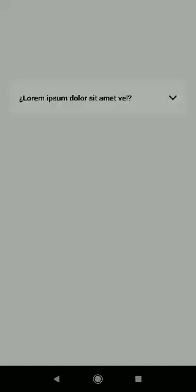

# react-native-accordion-collapsible

[]() []() []() [](https://expo.io/)

***
Accordion Collapsible component for React Native
***



## Features
- For iOS and Android
- Full customizable
- Compatible with `Expo`.

## Installation

```sh
npm install react-native-accordion-collapsible react-native-reanimated
```
***required react-native-reanimated v3**
***


## Usage

```js
import { View, Text } from 'react-native'
import Accordion from 'react-native-accordion-collapsible';

// ...

<Accordion headerText='Lorem ipsum' style={styles.accordion} styleContent={accordionContent}>
  <Text>
    Lorem ipsum dolor sit amet, consectetur adipiscing elit.
    Nam eu massa viverra, malesuada metus sed, malesuada dui.
  </Text>
</Accordion>


const styles = StyleSheet.create({
  accordion: {
    marginTop: 150,
    marginHorizontal: 20
  },
  accordionContent: {
    paddingTop: 10
  }
})

```

## API

| Prop                     | Type                   | Required |  Description      | 
| ------------------------ | ---------------------- | -------- | ----------------- |    
| children                 | ReactNativeElement     | Yes      | Accordion content |
| headerText               | string                 | Yes      | Accordion Title   |
| iconRight                | ReactNativeElement     | No       | chevron icon
| style                    | Styles                 | No       | Accordion styles
| styleContent             | Styles                 | No       | styles for the content container 
| styleHeader              | Styles                 | No       | header container styles 
| styleHeaderIconContainer | Styles                 | No       | styles for iconRight container 
| styleHeaderText          | Styles                 | No       | Styles for header text 


## Contributing

See the [contributing guide](CONTRIBUTING.md) to learn how to contribute to the repository and the development workflow.

## License

MIT

---

Made with [create-react-native-library](https://github.com/callstack/react-native-builder-bob)
